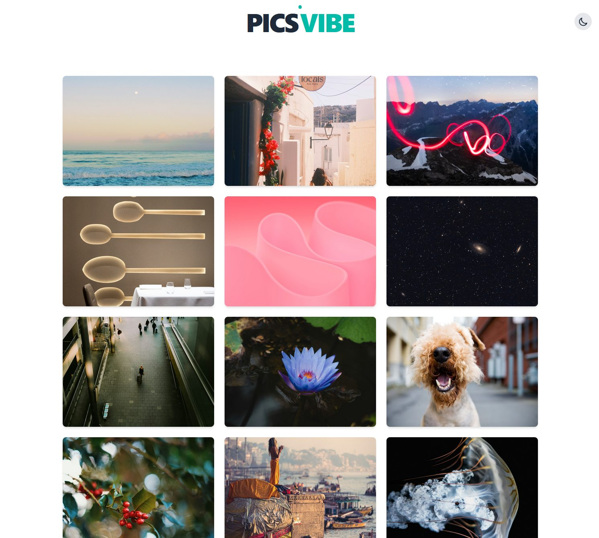

# PicsVibe - Galería de Imágenes con Unsplash



Aplicación web para explorar imágenes de Unsplash, modal de detalles y soporte para modo claro/oscuro.

## 🚀 Características

- 📸 Conexión con la API de Unsplash
- ♾️ Carga de imágenes al hacer clic en "Ver más"
- 🔍 Modal con información detallada de cada imagen
- 🌗 Toggle entre modo claro y oscuro
- 🎨 Diseño responsive con Tailwind CSS

## 🛠️ Tecnologías

- React
- TypeScript
- Tailwind CSS
- API de Unsplash

## 📦 Instalación

1. Clonar el repositorio:
   ```bash    
   git clone https://github.com/sebasdex/load-images.git
   cd load-images
   pnpm install
2. Crea Variable de entorno .env
   ```bash    
   YOUR_ENVIROMENT_VARIABLE=YOUR_KEY_NAME

## 🌟 Demo
Puedes probar la aplicación en [PicsVibe](https://picsvibe.netlify.app)
